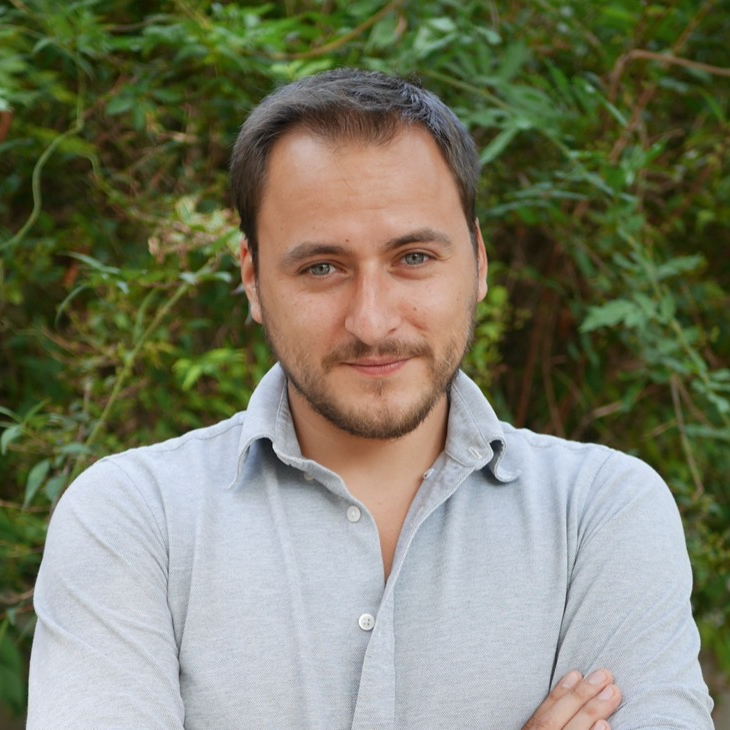

<br> 

{width=360 style="float:left; padding:16px"}

<br>
I'm a researcher in public economics based at the [Paris School of Economics](https://www.parisschoolofeconomics.eu/) and [Roma Tre](https://www.uniroma3.it). I'm the [coordinator for Latin America](https://wid.world/team/) at the [World Inequality Database](http://wid.world/) and the data architect for the [GC Wealth Project](https://wealthproject.gc.cuny.edu). I also work as a consultant for [UN-ECLAC](https://www.cepal.org/es/acerca/historia-cepal) to improve Latin American distributional statistics. I'm one of the co-directors of [Centro Contribuye](https://centrocontribuye.org), a hub for tax-related studies in Latin America. Before, I was a postdoctoral researcher at the [Stone Center](https://stonecenter.gc.cuny.edu/) in the [City University of New York](http://www.cuny.edu/) and before that I worked at [INSEAD](https://www.insead.edu). 

My [research](http://ignacioflores.com/research.html) focuses mainly on the historical evolution of wealth and income concentration, with particular interest on how inequality affects resilience to climate change. I'm also interested in taxation and how inequality interacts with the political sphere and institutions. 

Most of the code and data that I use and produce is publicly available in my [GitHub](https://github.com/ignacio-flores) profile. You can also check my [CV](pdf/CV_Ignacio_Flores.pdf), and my [Google Scholar](https://scholar.google.com/citations?user=ILFlGwMAAAAJ&hl=fr&oi=sra) and [ORCID](https://orcid.org/0000-0003-4478-2406) profiles too.

<br>

```{r load_packages, message=FALSE, warning=FALSE, include=FALSE} 
library(fontawesome)
```    

`r fa("envelope")` You can contact me at ignacio.flores@psemail.eu

 `r fa("dove")` Or sending a pigeon to 48 Boulevard Jourdan, 75014 Paris. 

